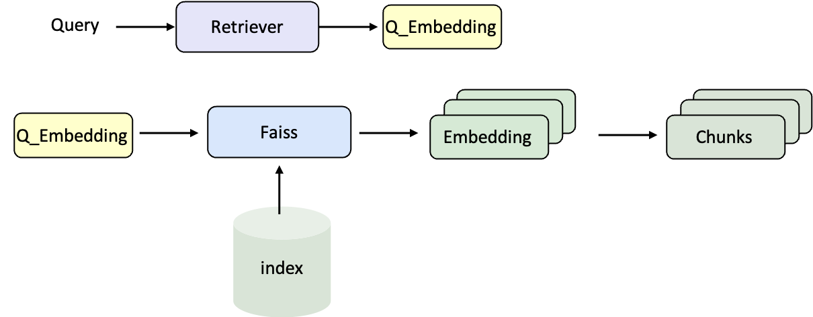

# UltraRAG 2.0 Getting Started Tutorial: Running RAG from Scratch

## What is RAG?

> Imagine you are taking an open-book exam. You yourself are a large language model, capable of understanding questions and writing answers.  
> But you cannot remember all knowledge points. At this time, you are allowed to bring a textbook or reference book into the exam — this is retrieval.  
> When you flip through the book to find relevant content and then combine your own understanding to write the answer, the answer is both accurate and well-founded.  
> This is RAG — Retrieval-Augmented Generation.

RAG (Retrieval-Augmented Generation) is a technique that allows large language models (LLMs) to first "retrieve" relevant documents or knowledge bases before "generating" answers, and then generate responses by combining this information.

### Process

**Retrieval stage**: Based on the user's question, find the most relevant content from the document library (such as knowledge bases, web pages, etc.);  
<p align="left">
  
</p>

**Generation stage**: Use the retrieved content as context input to the LLM, letting it generate answers based on this information  
<p align="left">
  
</p>

### Benefits

- Improve accuracy and reduce "hallucinations"
- No need to retrain the model, while maintaining timeliness and professionalism
- Enhance credibility
  

## About UltraRAG 2.0
UltraRAG 2.0 is an open-source RAG framework jointly launched by THUNLP Lab at Tsinghua University, NEUIR Lab at Northeastern University, OpenBMB, and AI9stars. Its biggest feature is that it is the first RAG system designed based on the Model Context Protocol (MCP) architecture.  
With MCP's modular design, researchers only need to write a single YAML file to directly describe the complete retrieval and generation process. Whether it is simple serial reasoning or more complex loops and conditional branching logic, it can be easily implemented.  
<p align="left">
  
</p>
This approach greatly reduces the complexity of engineering implementation. Researchers no longer need to spend time on complicated control logic and can devote more energy to experiment design and algorithm innovation. In one sentence: **Write less code, write more ideas**.


## Installation

1. Clone the repository

```bash
git clone https://github.com/OpenBMB/UltraRAG.git
cd UltraRAG
```

2. Create and activate a virtual environment

```bash
conda create -n ultrarag python=3.11
conda activate ultrarag

pip install uv
uv pip install -e .

# If you want to use faiss for vector indexing:
# You need to manually compile and install the CPU or GPU version of FAISS depending on your hardware environment:
# CPU version:
uv pip install faiss-cpu
# GPU version (example: CUDA 12.x)
uv pip install faiss-gpu-cu12
# For other CUDA versions, install the corresponding package (e.g., faiss-gpu-cu11 for CUDA 11.x).

# If you want to use infinity_emb for corpus encoding and indexing:
uv pip install -e ."[infinity_emb]"

# If you want to use lancedb vector database:
uv pip install -e ."[lancedb]"

# If you want to deploy models with vLLM service:
uv pip install -e ."[vllm]"

# If you want to use corpus document parsing functionality:
uv pip install -e ."[corpus]"

# ====== Install all dependencies (except faiss) ======
uv pip install -e ."[all]"
```

3. Verify installation

```bash
# Output: Hello, UltraRAG 2.0!
ultrarag run examples/sayhello.yaml
```

## Corpus Encoding and Indexing

Before using RAG, you need to convert the original documents into vector representations and build a retrieval index. This way, when the user asks a question, the system can quickly find the most relevant content in a large-scale corpus.  
- **Encoding (Embedding)**: Convert natural language text into vectors so that the computer can mathematically compare semantic similarity.  
- **Indexing**: Organize these vectors, for example using FAISS, so that retrieval can instantly find the most relevant entries among millions of documents.

<p align="left">
  
</p>

### Sample Corpus (Wiki Text)

```json
{
    "id": "2066692", 
    "contents": "Truman Sports Complex The Harry S. Truman Sports Complex is a sports and entertainment facility located in Kansas City, Missouri. It is home to two major sports venues: Arrowhead Stadium—home of the National Football League's Kansas City Chiefs, and Kauffman Stadium—home of Major League Baseball's Kansas City Royals. The complex also hosts various other events during the year."
}
```
This is a typical Wiki corpus entry, where id is the unique identifier of the document, and contents is the actual text content. Later we will vectorize contents and build the index.

### Writing Encoding and Indexing Pipeline

```yaml
# MCP Server
servers:
  retriever: servers/retriever

# MCP Client Pipeline
pipeline:
- retriever.retriever_init
- retriever.retriever_embed
- retriever.retriever_index
```
Here we define a minimal three-step process: initialization → encoding → indexing.

### Compile Pipeline File

```bash
ultrarag build examples/embedding_and_index.yaml
```

### Modify Parameter File

```yaml
# examples/parameter/embedding_and_index_parameter.yaml
retriever:
  corpus_path: data/corpus_example.jsonl
  cuda_devices: 0,1
  embedding_path: embedding/embedding.npy
  faiss_use_gpu: true
  index_chunk_size: 50000
  index_path: index/index.index
  infinity_kwargs:
    batch_size: 16
    bettertransformer: false
    device: cuda
    pooling_method: cls
  overwrite: false
  retriever_path: your_path
```

### Run Pipeline File

```bash
ultrarag run examples/embedding_and_index.yaml
```
After successful execution, you will get the corresponding corpus vectors and index files. The subsequent RAG Pipeline can directly use them to complete retrieval.

## Building RAG Pipeline

Once the corpus index is ready, the next step is to combine the retriever and the large language model (LLM) to build a complete RAG Pipeline. This way, questions can be retrieved for relevant documents and then passed to the model for final answer generation.

### Retrieval Process

<p align="left">
  
</p>

### Generation Process

<p align="left">
  
</p>

### Data Format (Example from NQ Dataset)

```json
{
    "id": 0, 
    "question": "when was the last time anyone was on the moon", 
    "golden_answers": ["14 December 1972 UTC", "December 1972"], 
    "meta_data": {}
}
```
Each sample contains a question, golden answers, and additional metadata, which will be used as input and evaluation benchmarks later.

### Writing RAG Pipeline

```yaml
# Vanilla RAG demo

# MCP Server
servers:
  benchmark: servers/benchmark
  retriever: servers/retriever
  prompt: servers/prompt
  generation: servers/generation
  evaluation: servers/evaluation
  custom: servers/custom

# MCP Client Pipeline
pipeline:
- benchmark.get_data
- retriever.retriever_init
- retriever.retriever_search
- generation.initialize_local_vllm
- prompt.qa_rag_boxed
- generation.generate
- custom.output_extract_from_boxed
- evaluation.evaluate
```

The entire process completes in order:  
1. Read data → 2. Initialize retriever and search → 3. Launch LLM service →  
4. Concatenate prompt → 5. Generate answer → 6. Extract result → 7. Evaluate performance.

### Compile Pipeline File

```bash
ultrarag build examples/vanilla_rag.yaml
```

### Modify Parameter File (Specify Dataset, Model, and Retrieval Configurations)

```yaml
# examples/parameter/vanilla_rag_parameter.yaml
benchmark:
  benchmark:
    key_map:
      gt_ls: golden_answers
      q_ls: question
    limit: -1
    name: nq
    path: data/sample_nq_10.jsonl
    seed: 42
    shuffle: false
custom: {}
evaluation:
  metrics:
  - acc
  - f1
  - em
  - coverem
  - stringem
  - rouge-1
  - rouge-2
  - rouge-l
  save_path: output/evaluate_results.json
generation:
  api_key: ''
  base_url: http://localhost:8000/v1
  gpu_ids: 2,3
  model_name: Qwen3-8B
  model_path: your_path
  port: 8081
  sampling_params:
    extra_body:
      chat_template_kwargs:
        enable_thinking: false
      include_stop_str_in_output: true
      top_k: 20
    max_tokens: 2048
    temperature: 0.7
    top_p: 0.8
prompt:
  template: prompt/qa_rag_boxed.jinja
retriever:
  corpus_path: data/corpus_example.jsonl
  cuda_devices: '0'
  faiss_use_gpu: true
  index_path: index/index.index
  infinity_kwargs:
    batch_size: 1024
    bettertransformer: false
    device: cuda
    pooling_method: auto
  query_instruction: 'Query: '
  retriever_path: your_path
  top_k: 5
  use_openai: false
```

### Run Pipeline File

```bash
ultrarag run examples/vanilla_rag.yaml
```

### View Generation Results

Use visualization script to quickly browse model outputs

```python
python ./script/case_study.py \
  --data output/memory_nq_vanilla_rag_20250830_161907.json \
  --host 0.0.0.0 \
  --port 8017 \
  --title "Case Study Viewer"
```
