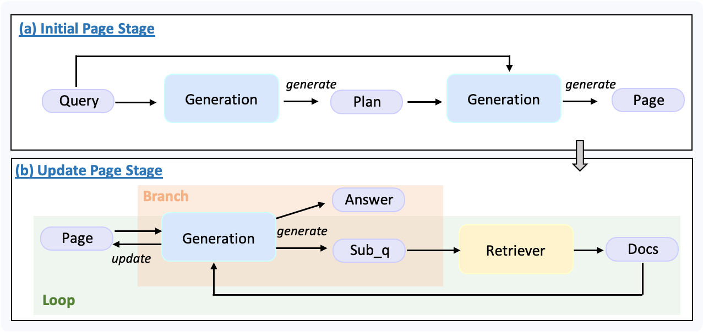
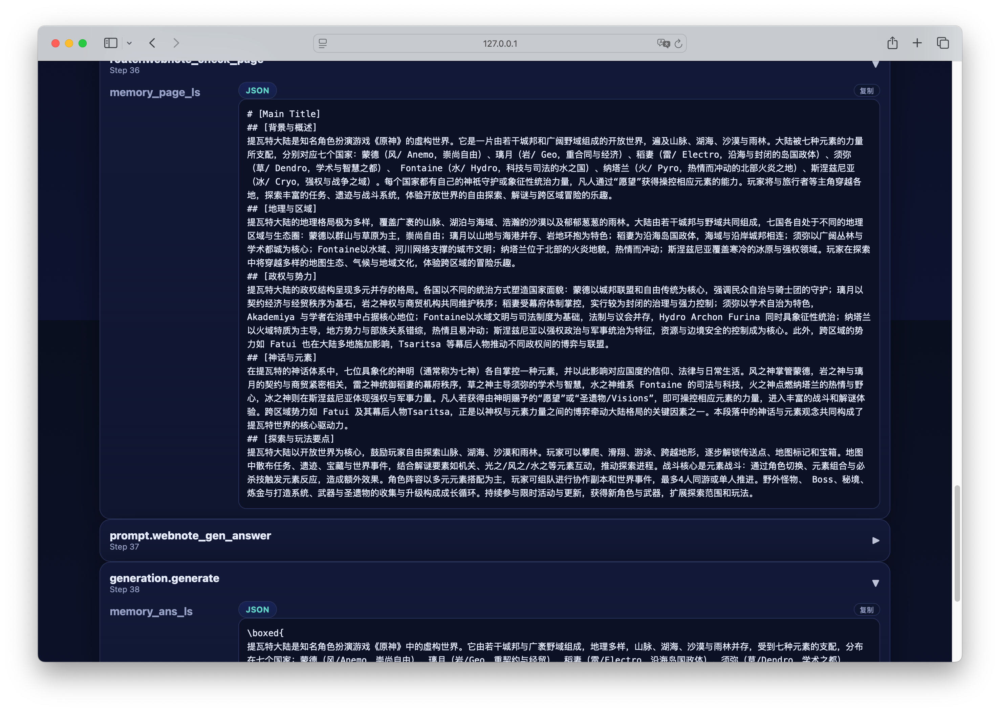

# Building a Lightweight DeepResearch Locally Based on UltraRAG

## What is DeepResearch

Deep Research (also known as Agentic Deep Research) refers to an intelligent research agent where large language models (LLMs) collaborate with tools (such as search, browser, code execution, memory storage, etc.) to complete complex tasks through a closed-loop process of "multi-turn reasoning → retrieval → verification → integration."

Unlike single retrieval RAG (Retrieval-Augmented Generation), Deep Research resembles the thought process of a human expert — first making a plan, then continuously exploring, adjusting direction, verifying information, and finally producing a well-structured report with sources.

## Prerequisites

In this development example, we will build a demonstration based on the UltraRAG framework. Considering that most users may not have access to powerful servers, we implement the entire process on a MacBook Air (M2), ensuring a lightweight and easy-to-reproduce environment.

### UltraRAG Environment Setup

```bash
# Create and activate Conda environment
conda create -n ultrarag python=3.11
conda activate ultrarag

# Clone the project and enter the directory
git clone https://github.com/OpenBMB/UltraRAG.git
cd UltraRAG


# Install dependencies using uv
pip install uv
uv pip install -e .
```

### API Preparation

- Retrieval API: We use [Tavily Web Search](https://www.tavily.com/), which provides 1000 free calls upon initial registration.
- LLM API: You can choose any large model service according to your preference. In this tutorial, we use gpt-5-nano as an example.

### API Configuration

We offer two ways to pass API Keys: environment variables and explicit parameters. It is recommended to use environment variables for better security and to avoid API Key leakage in logs.

```bash
export LLM_API_KEY="your llm key"
export TAVILY_API_KEY="your retriever key"
```

## Hands-on Development

In this example, we will implement a lightweight Deep Research Pipeline with the following core functionalities:

- Plan formulation: The model first creates a solution plan based on the user's question;
- Sub-question generation and retrieval: The main question is broken down into retrievable sub-questions, and web search tools are used to gather related information;
- Report organization and filling: The research report content is progressively refined;
- Reasoning and final generation: After the report is completed, the model outputs the final answer.

The flowchart is shown below:

<p align="left">
  
</p>

This pipeline mainly consists of two stages:

1. **Initialization stage:** The model generates a plan based on the user's question and constructs an initial report page accordingly.

2. **Iterative filling stage:**
   
- The system checks whether the current report page is complete.
- The criterion is whether the page still contains the string "to be filled."
- If the report is not yet complete, the model generates a new sub-question by combining the user's question, the plan, and the current page, and triggers a web search.
- Retrieved documents are used to update the page, then the next check is performed.
- This process iterates until the page is fully filled.
  
Finally, the model generates a complete answer based on the user's question and the final report page.

The code implementation of this example is very concise, mainly relying on custom extensions of the router and prompt tools. Interested users can directly check the source code.

UltraRAG development techniques involved include:

- [Prompt Tool Development](https://ultrarag.openbmb.cn/pages/en/tutorials/part_1/prompt)
- [Branch Decision Tool Development](https://ultrarag.openbmb.cn/pages/en/tutorials/part_1/router)
- [Loop Structure Pipeline](https://ultrarag.openbmb.cn/pages/en/tutorials/part_2/loop)
- [Branch Structure Pipeline](https://ultrarag.openbmb.cn/pages/en/tutorials/part_2/branch)
- [Parameter Renaming Mechanism](https://ultrarag.openbmb.cn/pages/en/tutorials/part_2/data_and_params)

Below is the complete pipeline definition (see examples/light_deepresearch.yaml):

```yaml
# light deepresearch demo

# MCP Server
servers:
  benchmark: servers/benchmark
  generation: servers/generation
  retriever: servers/retriever
  prompt: servers/prompt
  router: servers/router

# MCP Client Pipeline
pipeline:
- benchmark.get_data
# generate plan
- prompt.webnote_gen_plan
- generation.generate:
    output:
      ans_ls: plan_ls
# Initialize page
- prompt.webnote_init_page
- generation.generate:
    output:
      ans_ls: page_ls
# Iteratively generate sub-questions, retrieve information, and progressively fill the page
- loop:
    times: 10
    steps:
    # Trigger Check: determine whether the page is complete
    - branch:
        router:
        - router.webnote_check_page
        branches:
          # If the page is not complete, continue.
          incomplete:
          # generate sub question
          - prompt.webnote_gen_subq
          - generation.generate:
              output:
                ans_ls: subq_ls
          # retrieve answer
          - retriever.retriever_tavily_search:
              input:
                query_list: subq_ls
              output:
                ret_psg: psg_ls
          # fill page
          - prompt.webnote_fill_page
          - generation.generate:
              output:
                ans_ls: page_ls
          # If the page has been completed, stop.
          complete: []
# generate answer
- prompt.webnote_gen_answer
- generation.generate
```

## Launch

### Construct Question Data

First, create a file named sample_light_ds.jsonl in the data folder and write the question you want to research. For example:

```json
{
    "id": 0, 
    "question": "Introduce the continent of Teyvat", 
    "golden_answers": [], 
    "meta_data": {}
}
```

### Build Parameter Configuration File

Run the following command to generate the parameter file corresponding to the pipeline:

```bash
ultrarag build examples/light_deepresearch.yaml
```

This will generate light_deepresearch_parameter.yaml under examples/parameter/. Open this file and modify it according to your actual situation, for example:

```yaml
benchmark:
  benchmark:
    key_map:
      gt_ls: golden_answers
      q_ls: question
    limit: -1
    name: ds
    path: data/sample_light_ds.jsonl
    seed: 42
    shuffle: false
generation:
  api_key: ''
  base_url: your api url
  model_name: gpt-5-nano
  sampling_params:
    max_tokens: 4096
    temperature: 0.7
prompt:
  webnote_fill_page_template: prompt/webnote_fill_page.jinja
  webnote_gen_answer_template: prompt/webnote_gen_answer.jinja
  webnote_gen_plan_template: prompt/webnote_gen_plan.jinja
  webnote_gen_subq_template: prompt/webnote_gen_subq.jinja
  webnote_init_page_template: prompt/webnote_init_page.jinja
retriever:
  top_k: 5
```

### Set API Key

Before running, be sure to set your API Key. Although it can also be passed via parameters, it is recommended to use environment variables to avoid leaking keys into log files:

```bash
export LLM_API_KEY="your llm key"
export TAVILY_API_KEY="your retriever key"
```

### Start

```bash
ultrarag run examples/light_deepresearch.yaml
```

After running, you can visualize the generated content through the Case Study Viewer:

```python
python ./script/case_study.py \
  --data output/memory_ds_light_deepresearch_20250909_152727.json   \
  --host 127.0.0.1 \
  --port 8070 \
  --title "Case Study Viewer"
```

This will open the result page in your browser, allowing you to intuitively analyze the pipeline execution process and generated content.

<p align="left">
  
</p>