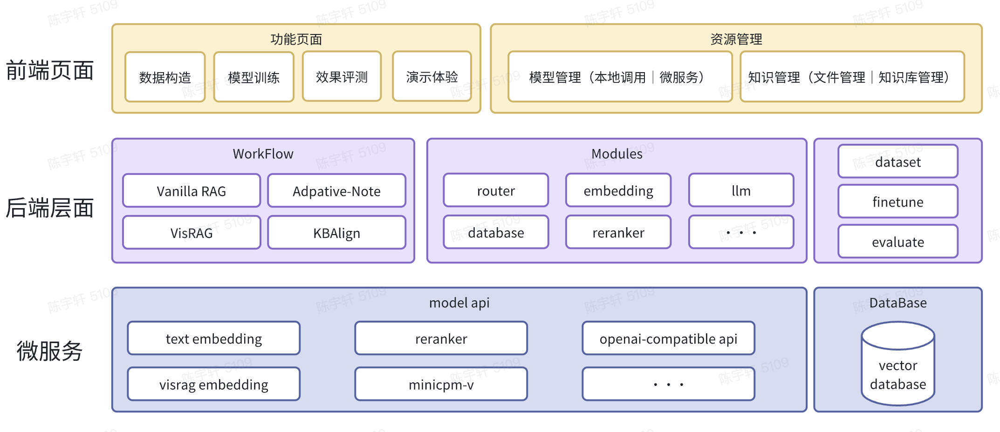

# UltraRAG

<div align="center">
    
</div>
<p align="center">
    【<a href="../README.md">English</a>   | Chinese | <a href="./README-Japanese.md">Japanese</a>】
</p>
<p align="center">
    【📚 <a href="https://modelbest.feishu.cn/docx/UDq0dzzm2omhWMxQ38bciLC7nyc">Document</a>】
</p>

## 📖 概述

UltraRAG是一个面向典型实现与灵活编辑的一站式RAG框架，同时支持快速实现研究型实验，以及个人的敏捷部署、评测和演示。和目前的RAG框架不同，UltraRAG 具有以下优势：
  - 开箱即用的一站式的 RAG 框架，覆盖了数据构造、模型微调、评测和体验等环节
  - 提供一个简单易用的WebUI，只需要在前端操作，无需编写代码即可完成各种的需求
  - 不断完善的技术支持，致力于丰富和完善UltraRAG功能，加速你的科研和项目进度

<div align="center">
    
</div>

## ✨️ 主要特点
- **效果体验**：UltraRAG 内置模块化工具，可灵活定制并体验个性化工作流，同时提供多种预设工作流，包括 VisRAG、Adaptive-Note 和 VanillaRAG，满足不同的使用需求。
- **数据构造**：从检索模型到生成模型，提供全流程的数据构造方案，可一键从知识库导入并生成数据。
- **适配微调**：支持 Embedding 模型训练及 LLM 的 DPO/SFT 微调，配套提供完整的训练脚本，便于利用构造好的数据进行模型调优。
- **效果评测**：涵盖检索模型与生成模型的多维评估指标，支持从整体到各环节全面评估模型和方法性能。
**以上全部功能，都可以直接通过 web 前端快速实现。**

<div align="center">
    
</div>

## 🔧整体架构
UltraRAG 的框架整体上分为三个部分：前端页面、后端模块、微服务等。
- 前端页面涉及资源管理和功能页面两个部分，资源管理包含模型管理和知识库管理；功能页面包含数据构造、模型训练、效果评测和推理体验。
- 后端模块分为 workflow、modules 和涉及模型调优套件：datasets（构造数据）、finetune（模型微调）和 evaluate（效果评测）。其中 workflow 提供了几类典型的工作流的实现，你也可以follow 其中示例开发自己的工作流；modules 提供几类RAG 场景中的典型的实现模块，每一类模块都可以方便地复用到 workflow 的开发过程中；模型调优套件提供了一整套的 pipeline 和技术方法，涵盖了各项论文的技术成果，目前也在不断更新中。
- 微服务接口：由于 UltraRAG 提供了涉及 RAG 的一站式框架方案，各类模型涉及到微调，因此需要具备微服务的部署能力，目前 UltraRAG 已经加入了对主流 RAG 链路中经典模型的支持，后续也会不断完善，兼容更多的模型。

<div align="center">
    
</div>

## ⚡️快速开始
UltraRAG支持在单机部署简单的演示demo，你可以通过导入python依赖的方式在本地部署简单的UI对话示例。你可以通过以下几种方式使用 UltraRAG 框架：
1. docker部署
    
    运行以下命令，然后在浏览器访问“http://localhost:8843"
    ```bash
    docker-compose up --build -d
    ```
2. conda部署
    ```bash
    # 创建conda环境
    conda create -n UltraRAG python=3.10

    # 激活conda环境
    conda activate UltraRAG

    # 安装相关依赖
    pip install -r requirements.txt

    # 运行demo页面
    streamlit run UltraRAG/webui/app.py --server.fileWatcherType none
    ```

### 模型下载
运行以下指令下载模型，默认下载到**resources/models**目录下，下载的模型列表在**UltraRAG/resources/models/model_list.txt**中
```bash
python UltraRAG/scripts/download_models.py
```

### 环境依赖

**cuda**版本在**12.2**及以上

**python**版本在**3.10**及以上

## 💫典型实现

结合法律领域数据评测VanillaRAG模型微调前后的效果

1. **VanillaRAG-original**  
   使用 UltraRAG 默认的模型（BGE-M3 + MiniCPM3-4B）下评测的效果。
2. **VanillaRAG-finetune**  
   基于法律领域数据，对 UltraRAG-Embedding 和 UltraRAG-DDR 进行微调后的效果。

以下是这两个 workflow 使用 UltraRAG 的评测页面得到的结果。微调后整体效果提升 **3%**，其中知识问答略有下降，但法条预测和咨询两个数据集均提升 **2% 以上**。

---

| **方法**              | **知识问答 (1-2)** | **法条预测 (3-2)** | **咨询 (3-8)** | **平均** |
|------------------------|--------------------|---------------------|----------------|----------|
| **Vanilla**            | 68.8              | 44.96              | 23.65         | 45.80    |
| **Renote**             | -                 | -                  | -             | -        |
| **Embedding**          | -                 | -                  | -             | -        |
| **DDR**                | -                 | 53.14              | 23.59         | -        |
| **KBAlign**            | -                 | -                  | -             | -        |
| **Finetune**           | 67.8              | 52.80              | 25.85         | 48.82    |

| 模型                                       | 由gpt4o造的测试集 200条 MRR@10 | 由gpt4o造的测试集 200条 NDCG@10 | 由gpt4o造的测试集 200条 Recall@10 |
|------------------------------------------|-----------------------------|------------------------------|-------------------------------|
| UltraRAG-Embedding                       | 36.46                       | 40.05                        | 54.50                         |
| UltraRAG-Embedding-Finetune(Qwen2.5-14B-instruction造的2800条) | 37.57                       | 42.12                        | 56.50                         |


## ‍🤝致谢
感谢以下贡献者的代码提交和测试，欢迎新成员加入我们，致力于构建完整生态！

<a href="https://github.com/OpenBMB/UltraRAG/contributors">
  
</a>

## 🌟趋势

<a href="https://star-history.com/#OpenBMB/UltraRAG&Date">
 <picture>
   <source media="(prefers-color-scheme: dark)" srcset="https://api.star-history.com/svg?repos=OpenBMB/UltraRAG&type=Date&theme=dark" />
   <source media="(prefers-color-scheme: light)" srcset="https://api.star-history.com/svg?repos=OpenBMB/UltraRAG&type=Date" />
   
 </picture>
</a>

## ⚖️许可

- 源代码采用[Apache-2.0](https://github.com/OpenBMB/MiniCPM/blob/main/LICENSE)许可证授权。

## 📑引用
如果您觉得这个仓库有用，请考虑给一个星标 ⭐ 并引用支持。

```bib
@article{li2024rag,
  title={RAG-DDR: Optimizing Retrieval-Augmented Generation Using Differentiable Data Rewards},
  author={Li, Xinze and Mei, Sen and Liu, Zhenghao and Yan, Yukun and Wang, Shuo and Yu, Shi and Zeng, Zheni and Chen, Hao and Yu, Ge and Liu, Zhiyuan and others},
  journal={arXiv preprint arXiv:2410.13509},
  year={2024}
}

@article{yu2024visrag,
  title={Visrag: Vision-based retrieval-augmented generation on multi-modality documents},
  author={Yu, Shi and Tang, Chaoyue and Xu, Bokai and Cui, Junbo and Ran, Junhao and Yan, Yukun and Liu, Zhenghao and Wang, Shuo and Han, Xu and Liu, Zhiyuan and others},
  journal={arXiv preprint arXiv:2410.10594},
  year={2024}
}

@article{wang2024retriever,
  title={Retriever-and-Memory: Towards Adaptive Note-Enhanced Retrieval-Augmented Generation},
  author={Wang, Ruobing and Zha, Daren and Yu, Shi and Zhao, Qingfei and Chen, Yuxuan and Wang, Yixuan and Wang, Shuo and Yan, Yukun and Liu, Zhenghao and Han, Xu and others},
  journal={arXiv preprint arXiv:2410.08821},
  year={2024}
}

@article{zeng2024kbalign,
  title={KBAlign: KBAlign: Efficient Self Adaptation on Specific Knowledge Bases},
  author={Zeng, Zheni and Chen, Yuxuan and Yu, Shi and Yan, Yukun and Liu, Zhenghao and Wang, Shuo and Han, Xu and Liu, Zhiyuan and Sun, Maosong},
  journal={arXiv preprint arXiv:2411.14790},
  year={2024}
}
```

